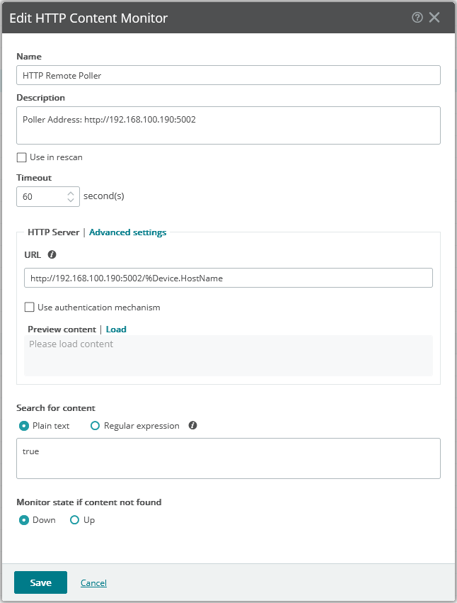
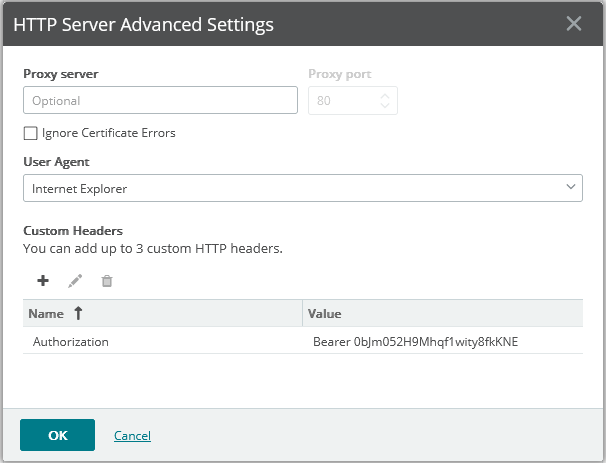
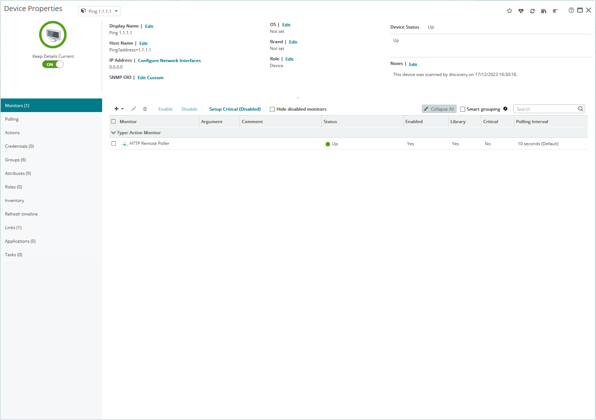

# WhatsUp Gold Remote Poller

> https://www.whatsupgold.com

---

### Pre built container

>https://hub.docker.com/r/zimbres/whatsup-gold-remote-poller

---

Due to the lack of support for Linux environments in WhatsUp Gold, this software comes to the rescue by allowing remote pollers to run on Linux, Docker, as well as Windows.

---

### Usage:

Create an Active Monitor for HTTP Content Monitor using the address where the poller is running and the variable %Device.HostName. Set 'Search for content' to true:

`http://192.168.100.190:5002/%Device.HostName`

In the 'Advanced settings', set a custom header with the name 'Authorization' and the value identical to the one set in the appsettings.json file, for example, 'Bearer 0bJm052H9Mhqf1wity8fkKNE':

Create a Device with a dummy IP address (this value is ignored). Set the hostname as follows:

- Ping?address=1.1.1.1
- HTTP?address=https://google.com
- Certificate?address=https://google.com
- Tcp?address=1.1.1.1&port=80

The HTTP monitor will ignore any SSL invalid state.

The Certificate will check for validity and expiration 30 days in advance, unless a different value is set in the 'CertificateExpiration' field in the appsettings.json file.

`⚠️ Due to the way the httpClient is constructed for certificate validation, use it with care. Too frequent checks can lead to TCP exhaustion on the machine running the Poller. I suggest not setting the Polling Interval to less than 1 hour.`

Authentication can be disabled by changing to 'false' the value of 'AuthEnabled' in appsettings.json file

---

## ⭐ Features

  - ✅ Ping Monitor
  - ✅ Tcp Monitor
  - ✅ HTTP Monitor
  - ❌ HTTP Monitor with HTTP Request Method selection
  - ✅ Certificate Monitor
  - ✅ API Authentication
  - ❌ Other Monitor types
---

A pre-compiled package is available for Windows and Linux. It requires ASP.NET Core Runtime 8.x.

[Download .NET 8.0](https://dotnet.microsoft.com/en-us/download/dotnet/8.0)
